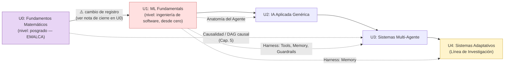

# AI-Agentic-Systems-Core

## Curso de Desarrollo y Despliegue de Sistemas Multiagente — UCEMICH

Repositorio hermano de [Programming-Logic-Agentic-AI-Development](https://github.com/Multiagent-AI-Lab/Programming-Logic-Agentic-AI-Development),
[Probability-Statistics-Agentic-AI-Core](https://github.com/Multiagent-AI-Lab/Probability-Statistics-Agentic-AI-Core)
y [Antigravity-Nano-Research-Multiagentic-Core](https://github.com/Multiagent-AI-Lab/Antigravity-Nano-Research-Multiagentic-Core).

**El fin de este curso es U3: construir y desplegar sistemas multiagente
de producción.** Todo lo anterior es fundamento, no destino:

- **U0 (matemática)** no enseña matemática por sí misma — muestra cómo esas
  herramientas (álgebra lineal, cálculo, probabilidad, información) se
  ensamblan hoy dentro de los sistemas de IA reales que el resto del curso
  construye y despliega.
- **U1-U2 (ML clásico, IA aplicada)** ya no son el punto de llegada que
  fueron en la IA de hace una década. Entrenar un árbol de decisión, ajustar
  hiperparámetros, elegir entre optimización bayesiana o grid search: son
  tareas que hoy un **agente puede orquestar y decidir por sí mismo** — un
  sistema multiagente moderno usa modelos clásicos como una herramienta más
  dentro de su Harness (ver U1), no como el producto final del ingeniero.
  U1-U2 dan el vocabulario y el criterio de decisión que ese agente necesita
  para tomar esas mismas decisiones — se aprenden porque hay que saber
  evaluarlas, no porque construir un clasificador sea ya el trabajo central
  de quien diseña sistemas de IA en 2026.
- **U3 (Sistemas Multi-Agente)** es donde el curso llega a su tema real: no
  un modelo aislado, sino varios agentes (o un agente con herramientas y
  memoria persistente) coordinados para resolver tareas — el 80% de la
  práctica ejecutable del curso vive aquí (337 celdas de código real en
  `notebooks/practica_u3/`, más que el resto de las unidades juntas).
- **U4** mira hacia adelante: qué pasa cuando el propio agente cambia su
  comportamiento con el tiempo, en vez de ejecutar una política fija.

Cubre los fundamentos genéricos de IA/ML/Sistemas Multi-Agente que antes
vivían mezclados con contenido de nanotecnología en Antigravity-Nano.
Antigravity-Nano depende de este repo como prerequisito curricular para
sus propias unidades aplicadas.

Ver `docs/superpowers/specs/` para el diseño completo de esta separación.

---

## 🚀 Configuración del Entorno de Trabajo

El proyecto usa su propio entorno conda `sys_agents`, con Python 3.11 —
independiente del `ia_nano` de Antigravity-Nano-Research-Multiagentic-Core.
Cada repo evoluciona sus propias dependencias (este repo es genérico de
IA/ML/Sistemas Multi-Agente; Antigravity-Nano es específico de
nanotecnología), así que no comparten entorno pese a ser repos hermanos.

### 1. Crear / Actualizar el Entorno Conda

```bash
conda env create -f environment.yml
```

o, si el entorno ya existe:

```bash
conda env update -f environment.yml
```

### 2. Activar el Entorno

```bash
conda activate sys_agents
```

### 3. Instalar el paquete en modo editable

```bash
pip install -e ".[dev]"
```

### 4. Correr la suite de tests

```bash
pytest tests/ -v --tb=short
```

## Estructura del curso

**Público objetivo:** este curso no es para quien está aprendiendo bases de
matemáticas por primera vez (a diferencia de LP, U1-U3 de primer semestre).
Está pensado para quien **ya sabe álgebra lineal, cálculo multivariable y
probabilidad** y quiere aprender a construir sistemas multiagente de
calidad — aplicables después a nanotecnología (Antigravity-Nano) o a
cualquier otro dominio.

El contenido pedagógico en `lecciones/` cubre 5 unidades (U0-U4). U0-U3 son
práctica estandarizada (fundamentos y patrones ya consolidados en la
industria); U4 es Línea de Investigación (contenido de frontera, sin el
mismo nivel de estandarización de producción que U0-U3).

| Unidad | Título | Tipo |
|---|---|---|
| U0 | Fundamentos Matemáticos | Práctica estandarizada |
| U1 | ML Fundamentals | Práctica estandarizada |
| U2 | IA Aplicada Genérica | Práctica estandarizada |
| U3 | Sistemas Multi-Agente (teoría + práctica) | Práctica estandarizada |
| U4 | Sistemas Agénticos Adaptativos | **Línea de Investigación** |

La práctica de U3 vive en `notebooks/practica_u3/` (8 notebooks, ver
sección "Notebooks de Práctica" de `lecciones/UNIDAD_3_SISTEMAS_MULTI_AGENTE.md`)
e instala con `pip install -e ".[practica-u3]"`.

### 🗺️ Mapa del Curso: Dependencias y Coherencia entre Unidades

El orden es estrictamente secuencial (U0→U4), pero dos capas de información
quedaban solo en prosa dispersa: dónde cambia el registro (nivel de
formalismo esperado del lector) y qué vocabulario/conceptos concretos
reaparecen explícitamente de una unidad a otra.



- **U0→U1** es la única transición con cambio de nivel de audiencia (de
  formalismo matemático de posgrado a ingeniería de software introductoria)
  — reconocido explícitamente en la sección "Antes de continuar: un cambio
  deliberado de registro" al cierre de U0, para que el lector re-calibre
  expectativas en vez de sentir un salto sin explicación.
- **Harness** (Modelo + Harness: Tools, Memory, Guardrails — definido en
  U1) es el hilo conductor más largo del curso: reaparece explícitamente al
  organizar los 3 vectores de ataque de la sección de Seguridad en U3
  (tool misuse ataca Tools, memory poisoning ataca Memory), y otra vez en
  U4 al discutir por qué un agente que aprende agrava el riesgo de memory
  poisoning sobre su propio componente Memory.
- **Causalidad / DAG causal** (Capítulo 5 de U0) es la segunda conexión
  diferida más larga: se retoma explícitamente en la fase de Evaluación
  de U3, para distinguir causa de correlación al depurar fallos en un
  sistema multiagente.

## Estructura del repositorio

```
src/multiagent_core/   # Agentes Python (ver docs/superpowers/specs/)
tests/                 # Suite de tests (pytest)
lecciones/             # Contenido pedagógico en Markdown (Sub-proyecto 3)
notebooks/             # Notebooks generados desde lecciones/ (no editar a mano)
docs/superpowers/      # Specs de diseño de este repo
```
